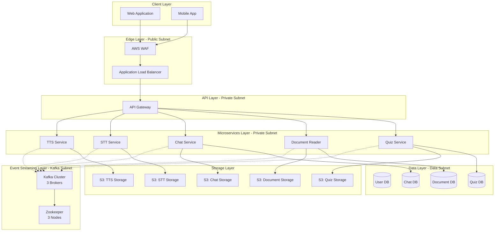

# Cloud-Based Learning Platform

> A comprehensive, enterprise-grade cloud learning platform built on AWS infrastructure with AI-powered educational services, event-driven architecture, and microservices design.

## 📋 Table of Contents

- [Overview](#overview)
- [Architecture](#architecture)
- [Key Features](#key-features)
- [Technology Stack](#technology-stack)
- [Project Phases](#project-phases)
- [Documentation](#documentation)
- [Getting Started](#getting-started)

## Overview

This project is a full-stack cloud-based learning platform that demonstrates enterprise-grade cloud architecture, microservices design patterns, and modern DevOps practices. Built as a comprehensive cloud computing educational project, it integrates multiple AWS services, Apache Kafka for event streaming, containerized microservices, and AI-powered learning tools.

### Learning Objectives

- ✅ Master AWS core services (IAM, EC2, EBS, S3, VPC, Lambda, ELB, RDS)
- ✅ Implement event-driven architecture using Apache Kafka
- ✅ Design and deploy containerized microservices
- ✅ Integrate API Gateway for service orchestration
- ✅ Implement isolated storage architecture
- ✅ Apply security best practices and access control

## Architecture

### High-Level Architecture



### Architecture Principles

1. **Microservices Architecture**: Each service is independently deployable and scalable
2. **Event-Driven Design**: Asynchronous communication via Apache Kafka
3. **Storage Isolation**: Each service has dedicated S3 buckets and databases
4. **High Availability**: Multi-AZ deployments across all layers
5. **Security First**: Zero-trust network, encryption at rest and in transit
6. **Infrastructure as Code**: Fully automated provisioning and deployment

## Key Features

### AI-Powered Educational Services

| Service | Description | Key Capabilities |
|---------|-------------|------------------|
| **Text-to-Speech (TTS)** | Convert text to natural speech | Multi-language support, multiple voice options, various audio formats |
| **Speech-to-Text (STT)** | Transcribe audio to text | Multi-format support, confidence scores, multi-language |
| **Chat Completion** | AI-powered conversational assistant | Context-aware, multi-turn conversations, document integration |
| **Document Reader** | Process and analyze documents | PDF/DOCX support, AI-generated notes, text extraction |
| **Quiz Generator** | Create assessments from documents | Multiple question types, automated scoring, detailed feedback |

### Infrastructure Features

- **Auto-Scaling**: Automatic scaling based on demand
- **Load Balancing**: Application and Network Load Balancers
- **Disaster Recovery**: Automated backups, Multi-AZ deployment
- **Monitoring**: CloudWatch integration, comprehensive logging
- **Security**: IAM roles, VPC isolation, encryption, WAF protection

## Technology Stack

### Cloud Infrastructure (AWS)
- **Compute**: EC2, Lambda, Auto Scaling
- **Storage**: S3, EBS
- **Database**: RDS (PostgreSQL)
- **Network**: VPC, ALB, NLB, Route53
- **Security**: IAM, KMS, Secrets Manager, WAF
- **Container**: ECR (Elastic Container Registry)

### Event Streaming
- **Apache Kafka**: 3-broker cluster for event streaming
- **Zookeeper**: 3-node ensemble for coordination

### Microservices
- **Language**: Python 3.11
- **Containerization**: Docker
- **Orchestration**: Kubernetes / Docker Swarm
- **API Gateway**: Kong / AWS API Gateway

### AI/ML Libraries
- **TTS**: gTTS, Coqui TTS, AWS Polly
- **STT**: Whisper, SpeechRecognition, AWS Transcribe
- **Chat**: OpenAI SDK, LangChain, Hugging Face Transformers
- **Document Processing**: PyPDF2, python-docx, spaCy

### DevOps & CI/CD
- **CI/CD**: GitHub Actions / GitLab CI / AWS CodePipeline
- **Monitoring**: CloudWatch, Prometheus
- **Logging**: CloudWatch Logs, ELK Stack

## Project Phases

### Phase 1: AWS Infrastructure Layer (7 Marks)
**Deadline**: Thursday, 20/11/2025

- IAM setup and access control
- EC2 instances for containers and Kafka
- EBS volumes for persistent storage
- S3 buckets for service isolation
- VPC and network architecture
- Lambda functions for automation
- Load Balancers for high availability
- RDS databases for each service

### Phase 2: Microservices & Kafka Layer (7 Marks)
**Deadline**: Thursday, 04/12/2025

- Kafka cluster deployment
- Event-driven architecture implementation
- API Gateway configuration
- Microservices development and deployment
- Service isolation and communication

### Phase 3: Security, Storage & CI/CD (6 Marks)
**Deadline**: Thursday, 18/12/2025

- Security hardening
- Storage isolation enforcement
- CI/CD pipeline implementation
- Monitoring and logging setup
- Documentation completion

## Documentation

Comprehensive documentation is organized into the following sections:

### 📚 Core Documentation
- [Architecture Guide](./docs/ARCHITECTURE.md) - Detailed system architecture
- [AWS Infrastructure](./docs/AWS_INFRASTRUCTURE.md) - AWS services configuration
- [Network Architecture](./docs/NETWORK_ARCHITECTURE.md) - VPC, subnets, security groups

### 🔧 Microservices Documentation
- [TTS Service](./docs/services/TTS_SERVICE.md) - Text-to-Speech service
- [STT Service](./docs/services/STT_SERVICE.md) - Speech-to-Text service
- [Chat Service](./docs/services/CHAT_SERVICE.md) - Chat completion service
- [Document Reader](./docs/services/DOCUMENT_READER_SERVICE.md) - Document processing
- [Quiz Service](./docs/services/QUIZ_SERVICE.md) - Quiz generation service

### 📡 Integration & Events
- [Kafka Integration](./docs/KAFKA_INTEGRATION.md) - Event streaming architecture
- [API Gateway](./docs/API_GATEWAY.md) - API management and routing
- [Event Flows](./docs/EVENT_FLOWS.md) - Event-driven communication patterns

### 🔒 Security & Compliance
- [Security Guide](./docs/SECURITY.md) - Security best practices
- [IAM Policies](./docs/IAM_POLICIES.md) - Access control and permissions
- [Storage Isolation](./docs/STORAGE_ISOLATION.md) - Data isolation architecture

### 🚀 Deployment & Operations
- [Deployment Guide](./docs/DEPLOYMENT.md) - Container orchestration and deployment
- [CI/CD Pipeline](./docs/CICD.md) - Continuous integration and delivery
- [Operations Guide](./docs/OPERATIONS.md) - Monitoring, logging, troubleshooting
- [Disaster Recovery](./docs/DISASTER_RECOVERY.md) - Backup and recovery procedures

## Getting Started

### Prerequisites

- AWS Account with appropriate permissions
- Docker and Docker Compose installed
- Kubernetes cluster (optional, for K8s deployment)
- Python 3.11+
- Git

### Quick Start

1. **Clone the repository**
   ```bash
   git clone <repository-url>
   cd Learning-Platform
   ```

2. **Set up AWS credentials**
   ```bash
   aws configure
   ```

3. **Deploy infrastructure** (using Terraform/CloudFormation)
   ```bash
   cd infrastructure
   # Follow infrastructure deployment guide
   ```

4. **Deploy services**
   ```bash
   cd services
   # Follow service deployment guide
   ```

5. **Access the platform**
   - API Gateway URL: `https://<your-alb-dns>/api`
   - Documentation: `https://<your-alb-dns>/docs`

### Development Setup

See [Development Guide](./docs/DEVELOPMENT.md) for local development setup instructions.

## Project Structure

```
Learning-Platform/
├── docs/                          # Comprehensive documentation
│   ├── ARCHITECTURE.md
│   ├── AWS_INFRASTRUCTURE.md
│   ├── services/                  # Service-specific docs
│   └── ...
├── infrastructure/                # IaC (Terraform/CloudFormation)
│   ├── terraform/
│   ├── cloudformation/
│   └── ...
├── services/                      # Microservices
│   ├── tts-service/
│   ├── stt-service/
│   ├── chat-service/
│   ├── document-reader-service/
│   └── quiz-service/
├── api-gateway/                   # API Gateway configuration
├── kafka/                         # Kafka configuration
├── monitoring/                    # Monitoring and logging
├── scripts/                       # Automation scripts
└── README.md                      # This file
```

## Contributing

This is an educational project demonstrating cloud computing concepts and best practices.

## License

Educational project - All rights reserved

## Contact

For questions or support, please contact the project team.

---

**Built with ☁️ for cloud computing education**
